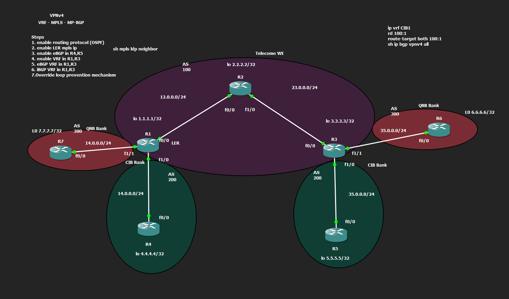
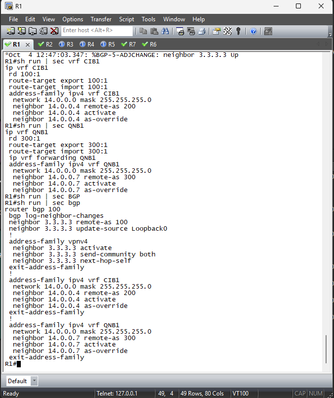
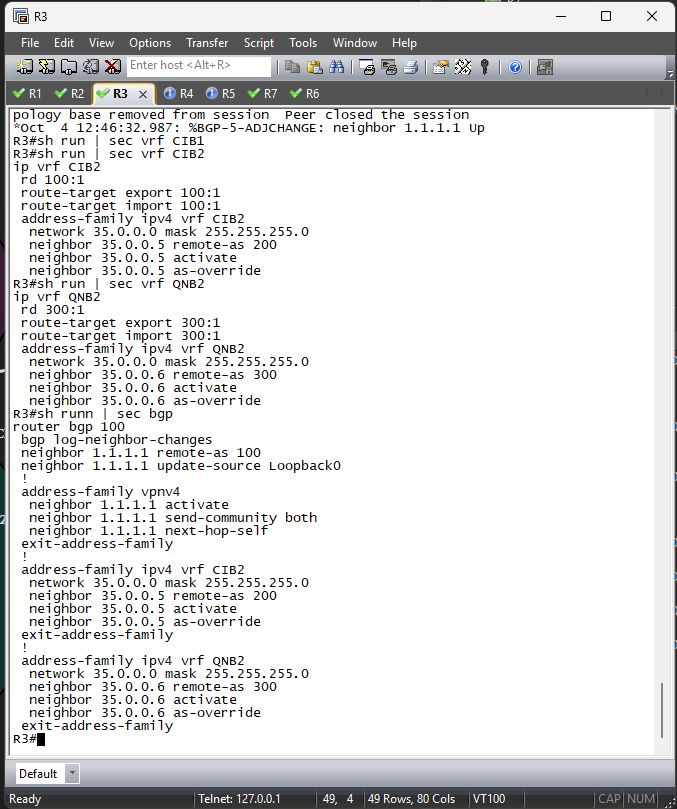
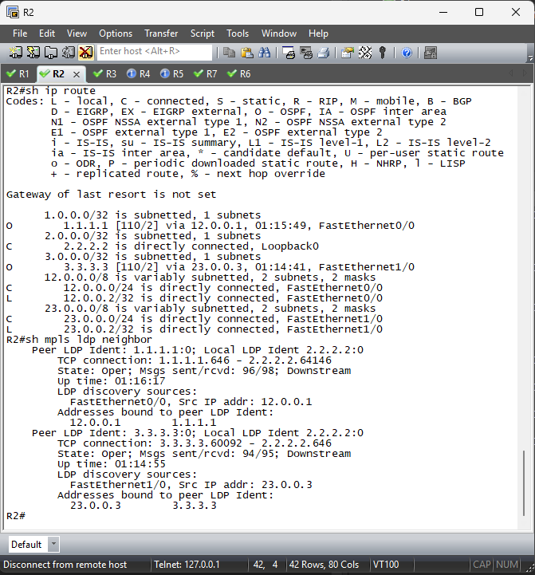
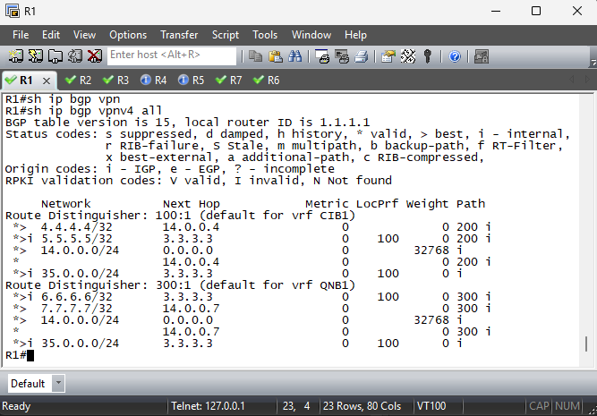
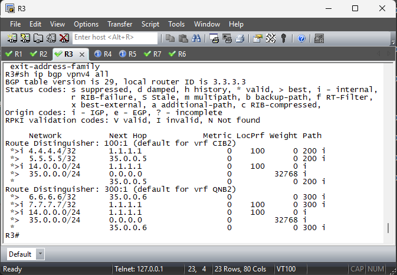

# VPNv4 over MPLS

This lab connects two customers, QNB and CIB, across a provider MPLS network. VRFs keep their traffic separate, while VPNv4 route distinguishers (RDs) make customer routes unique even when customers use overlapping IP addresses. OSPF and MPLS provide transport through the core, and MP-BGP carries VPN routes between the provider edge routers.

## Network at a glance



The lab has seven Cisco IOS routers:

| Routers | Role | AS / routing |
| --- | --- | --- |
| R1 and R3 | Provider edge (PE) routers | Provider AS 100; OSPF and MPLS in the core; MP-BGP VPNv4 between loopbacks |
| R2 | Provider (P) core router | OSPF and MPLS label switching; no customer VRFs |
| R4 and R5 | CIB Bank customer edge routers | Customer AS 200 |
| R6 and R7 | QNB Bank customer edge routers | Customer AS 300 |

R1 reaches R3 through R2. The provider-facing links are `12.0.0.0/24` and `23.0.0.0/24`; provider loopbacks `1.1.1.1/32` and `3.3.3.3/32` identify the PE routers. The customer-facing links are `14.0.0.0/24` at R1 and `35.0.0.0/24` at R3. Those same link prefixes are reused in separate VRFs, so they remain isolated.

## How the pieces fit together

1. **OSPF provides core reachability.** R1, R2 and R3 advertise their core interfaces and loopbacks in area 0.
2. **MPLS and LDP build the transport path.** MPLS is enabled on the provider core links; labels carry traffic between the PE routers.
3. **VRFs separate customers.** The PE routers define CIB and QNB VRFs. Their route targets are `100:1` for CIB and `300:1` for QNB.
4. **MP-BGP carries VPN routes.** R1 and R3 form an internal BGP session using their loopbacks and exchange VPNv4 routes with extended communities.
5. **Each PE exchanges routes with its customer.** R1 peers with R4 in CIB and R7 in QNB; R3 peers with R5 in CIB and R6 in QNB. `as-override` is configured on these PE-to-customer sessions to handle customer AS paths when routes cross the provider.

The result is a shared MPLS backbone carrying two logically separate customer networks. A customer route is associated with a VRF and route distinguisher at the PE, advertised across the core as VPNv4, then made available in the matching VRF at the other PE.

## Router configurations

The startup configurations are at the repository root:

IPv6 dual-stack variants for all seven routers are in [`ipv6-conf/`](ipv6-conf/README.md). They add VPNv6 for QNB and CIB while retaining the IPv4 services. See the [IPv6 design notes](ipv6-conf/README.md) for the 6VPE transport limitation.

| Router | Configuration | Notable function |
| --- | --- | --- |
| R1 | [`R1_i1_startup-config.cfg`](R1_i1_startup-config.cfg) | Left PE; CIB1 and QNB1 VRFs; customer BGP peers; VPNv4 peer to R3 |
| R2 | [`R2_i2_startup-config.cfg`](R2_i2_startup-config.cfg) | Core P router; OSPF and MPLS on both transit links |
| R3 | [`R3_i4_startup-config.cfg`](R3_i4_startup-config.cfg) | Right PE; CIB2 and QNB2 VRFs; customer BGP peers; VPNv4 peer to R1 |
| R4 | [`R4_i3_startup-config.cfg`](R4_i3_startup-config.cfg) | CIB customer edge on the left, AS 200 |
| R5 | [`R5_i5_startup-config.cfg`](R5_i5_startup-config.cfg) | CIB customer edge on the right, AS 200 |
| R6 | [`R6_i6_startup-config.cfg`](R6_i6_startup-config.cfg) | QNB customer edge on the right, AS 300 |
| R7 | [`R7_i7_startup-config.cfg`](R7_i7_startup-config.cfg) | QNB customer edge on the left, AS 300 |

## Lab evidence

These captures are in [`output/`](output/):

<details>
<summary>R1 and R3 VRF and BGP configuration</summary>





</details>

<details>
<summary>Core routes and LDP neighbors on R2</summary>



</details>

<details>
<summary>VPNv4 routes received at R1 and R3</summary>





</details>

The captures show the expected provider loopbacks in the core routing table, LDP neighbors on R2, and customer prefixes in the VPNv4 tables at both PE routers.

## Running the lab

Load each router's startup configuration in the network emulator or lab environment used for this project, then check the control plane:

```text
show ip ospf neighbor
show mpls ldp neighbor
show ip bgp vpnv4 all
show ip route vrf CIB1
show ip route vrf QNB1
```

On R3, use VRF names `CIB2` and `QNB2` for the last two checks. The exact interface/module setup depends on the emulator topology.

## Repository layout

```text
.
├── Toplogy/                  # Network diagram
├── output/                   # CLI screenshots from the lab
├── ipv6-conf/                # Dual-stack IPv6 and VPNv6 router configurations
├── R1_i1_startup-config.cfg
├── R2_i2_startup-config.cfg
├── R3_i4_startup-config.cfg
├── R4_i3_startup-config.cfg
├── R5_i5_startup-config.cfg
├── R6_i6_startup-config.cfg
└── R7_i7_startup-config.cfg
```

> GitHub renders repository Markdown with its own styles, so custom Google Fonts and CSS animations cannot be applied from a `README.md`. The image previews, tables and collapsible evidence sections keep this page readable on GitHub without external styling.
